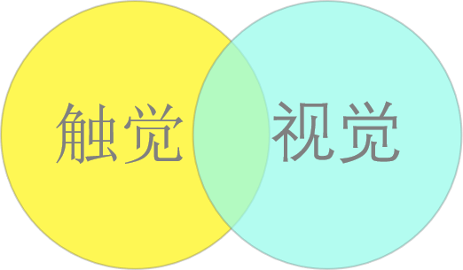
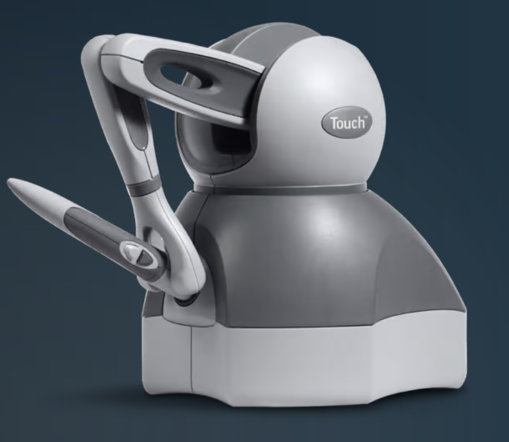

# Tiouch

2022 Taichi Hackathon参赛项目。

## 团队名：你说的都队

## 项目名：Tiouch

## 项目介绍：

Taichi 语言已经实现了很多物理仿真场景，在视觉上看起来很棒。但除了视觉之外，人感受世界另外一个重要的感觉就是力触觉。目前力触觉渲染多用于虚拟手术、虚拟装配等领域。受此启发，本项目就尝试将物理仿真的视觉效果和力触觉结合起来，给人更多维度对虚拟场景的感受。具体来说，就是使用力反馈设备，将新奇的触觉渲染效果融合到物理模拟中，我们不但可以看到屏幕中的弹性体在肆意运动与形变，还能用双手感受到物体的运动。力触觉渲染对性能有很高的要求，一般要上千帧的渲染效率。得益于高效的Taichi语言，我们期望实现一个既有物理模拟又包含触觉渲染的仿真场景。

---

## Inspiration

在米开朗基罗的《创造亚当》中，上帝与亚当即将碰触的指尖，喻示着人类将获得感受万物的六感之一——**触觉**。

Taichi的高性能物理仿真，创造了丰富的视觉盛宴，但我们想告诉你的是，Taichi能做的绝不仅仅是视觉，因此我们有了一个idea——**Taihci+Haptics**，交织出视觉和触觉的双重合奏。

## Pipline

我们通过**AOT**将Taichi的kernel部署到Unity当中，在Unity中基于Taichi C API和Taichi Unity Plugin构建Taichi runtime，这样就可以在Unity里启用我们的kernel运行啦。再通过Haptics Unity Plugin，用户就可以使用Haptics力反馈设备进行触觉的交互辣。

## Timeline

* 前期准备
  * Taichi编译、C API、Unity Example
* Unity场景搭建（11.30）
  * 加入Hapitc插件
  * 加入Rigid cubes
* Taichi编写物理场景(11.30-12.1)
  * 实现Rigid cubes
* Unity场景中加入Taichi rigid cubes (12.2)
* Unity加入交互 (12.3)

## 实现思路：

### 物理模拟部分：

使用Taichi实现核心物理模拟算法。考虑到Python运行时性能以及与力反馈设备开发的对接，我们组尝试发掘Taichi AoT功能；考虑到开发简易性和渲染效果，我们组使用Unity引擎实现图形程序框架。

尽管Taichi C API、 AoT以及Unity Plugin还属于热开发阶段，得益于[taichi-aot-demo](https://github.com/taichi-dev/taichi-aot-demo)和[Taichi-Unity Example](https://github.com/taichi-dev/Taichi-UnityExample)等样例以及开发人员的帮助，我们完成了Taichi kernel在Unity中的加载与运行。

### 力反馈部分：

尽管能摸到物体是一个很美好的设想，但我们没有力反馈手套那样炫酷的设备。取而代之的是3D Systems公司开发的[Touch Haptic Device](https://www.3dsystems.com/haptics-devices/touch)，Touch是一款6自由度的力反馈笔：“可在用户的手上施加力反馈，使他们能够感受虚拟对象并在用户操作屏幕上的 3D 对象时产生逼真的触感”。在力触觉渲染中，用户可以可以操作力反馈设备，控制力反馈设备在虚拟场景中的镜像物体，比如手术钳，笔等。镜像物体作为刚体与虚拟场景中其他物体交互产生交互力，通过力反馈接口设置反馈力，从而实现力触觉渲染。考虑到开发复杂度，我们使用3D Systems提供的Unity插件进行力反馈部分的开发。

## Challenges

* Unity中遇到帧率降低的问题
* V1.2.0和V1.3.0 向量之间外积行为不一致
* Dynamic index 开关行为不一致
* 碰撞处理

## 期望效果：

## Future Work

* 丰富场景
  * 增加柔体、流体、绳子、布料的仿真
  * 加入更丰富的力反馈效果，比如磁力
* 增加关卡
  * 设计有挑战性的关卡，提高可玩性和趣味性
  * 增加计分功能
  * 增加力反馈显示功能
  * 在VR环境中操作
* 提高性能
  * 提高场景性能和力触觉渲染的性能
  * 优化碰撞检测和碰撞处理

## 其他：

### 第三方Unity插件依赖

- [3D Systems Openhaptics Unity Plugin](https://assetstore.unity.com/packages/tools/integration/3d-systems-openhaptics-unity-plugin-134024)
